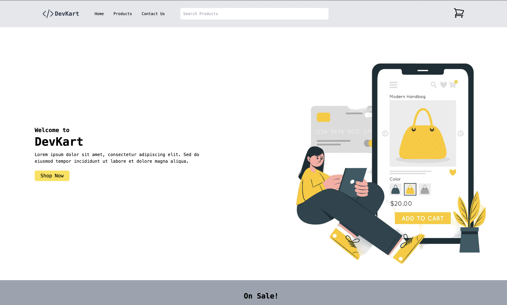
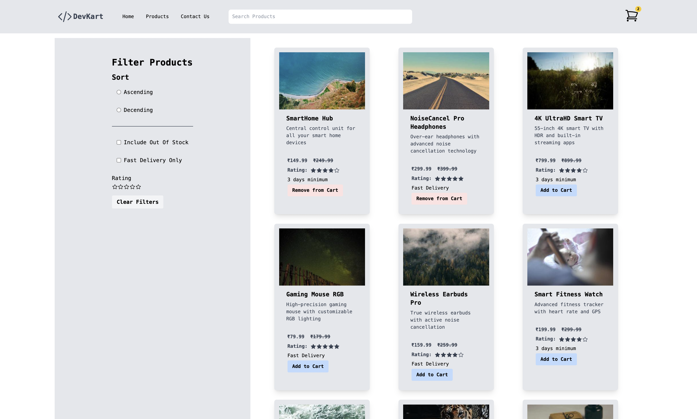
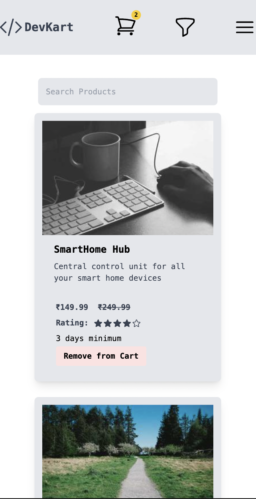
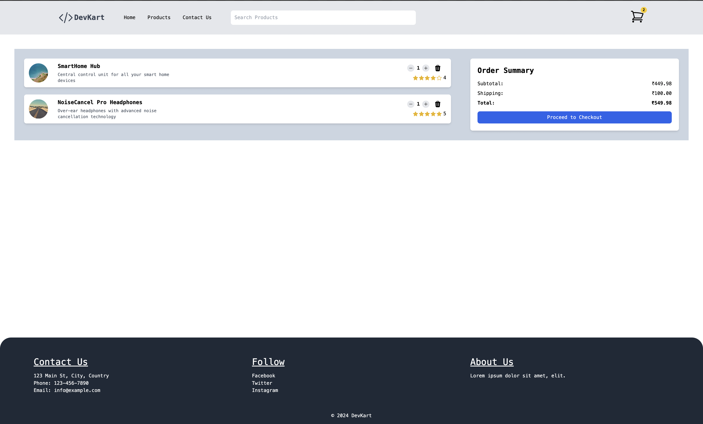
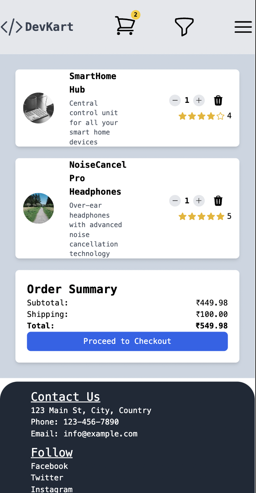
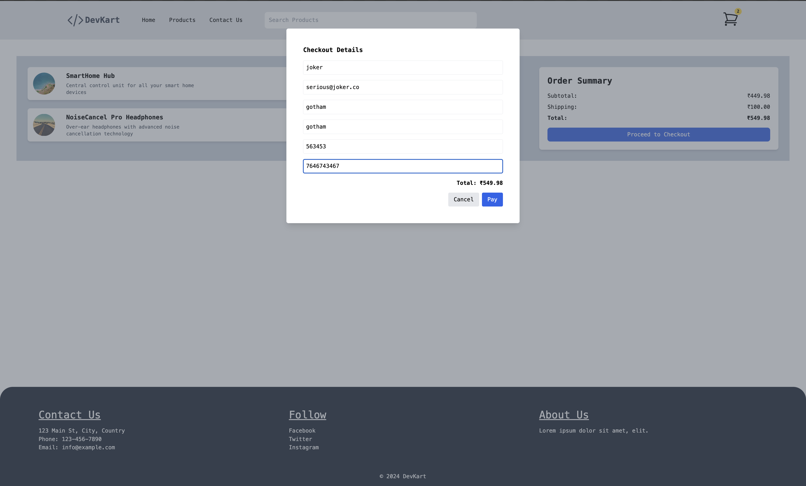
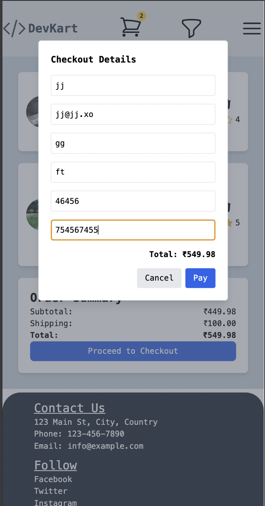
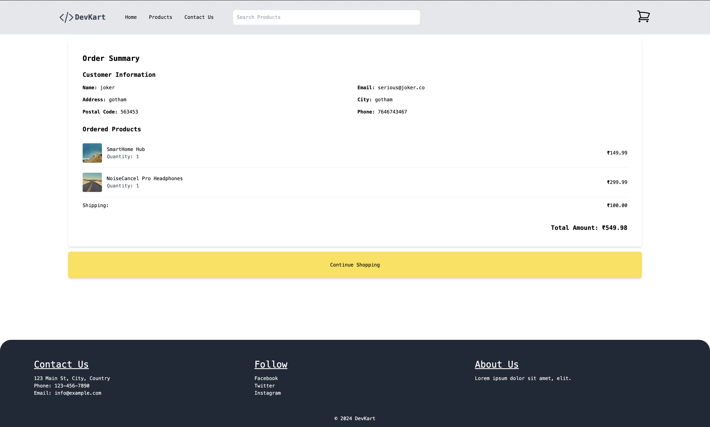
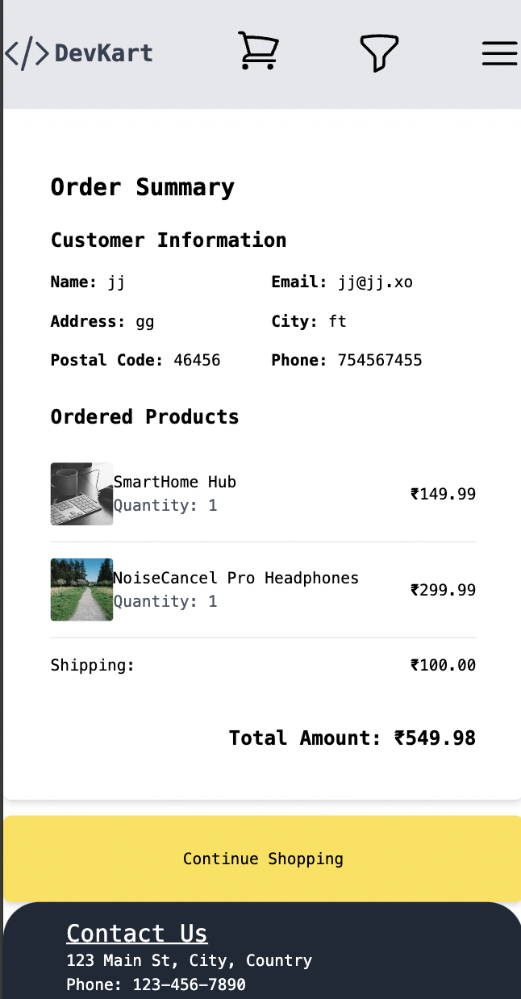
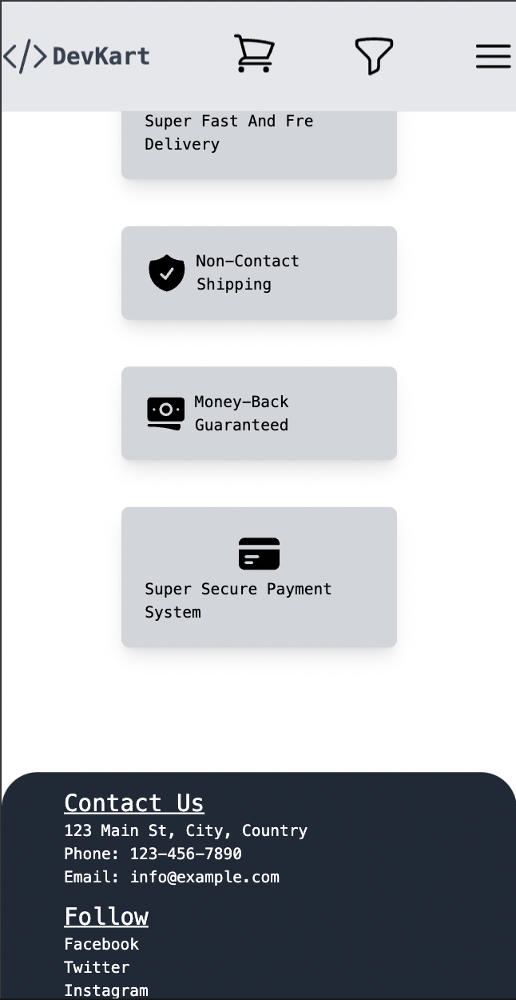

Here is a simple description of the project along with screenshots:

The Styx E-commerce project is a web-based application that allows users to browse and purchase various products online. It provides a seamless shopping experience with a user-friendly interface.

The homepage showcases featured products, promotions, and a search bar for easy navigation.

The product listing page displays a grid of products with their images, names, prices, and ratings. Users can filter and sort products based on their preferences.

Users can add products to their shopping cart and proceed to checkout. The shopping cart page displays a summary of the selected items, their quantities, and the total cost.

When a user clicks on a proceed to checkout , they are taken to the checkout details page. Here, they can fill address and acheckout

After completing the checkout process, users receive an order confirmation page with details about their purchase, including the order number and estimated delivery date.

The Styx E-commerce project aims to provide a seamless and enjoyable shopping experience for users, making it convenient to browse and purchase products online.

More Images:

